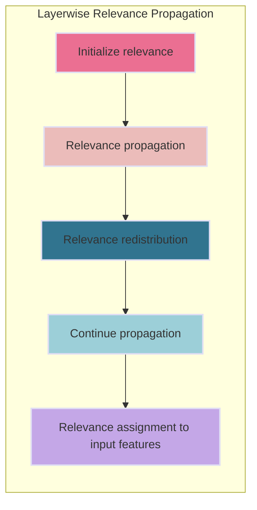

Layer-wise Relevance Propagation (LRP) is an interpretability technique used specifically for neural networks to understand the contribution of individual features or neurons in a neural model towards its predictions.

The idea behind LRP is to assign relevance scores to each neuron in the network, indicating how much it contributes to the final prediction. These relevance scores are then backpropagated through the layers of the network, distributing the relevance from output layer back to input layer.

### General Steps for LRP

1. **Initialize relevance:** Start by assigning relevance scores to the neurons in the output layer based on the model's prediction. The relevance is typically higher for neurons that contribute more to the prediction.
2. **Relevance propagation:** Starting from the output layer, propagate the relevance backward through the network. This involves distributing the relevance from each neuron to its input neurons in the previous layer based on their contribution.
3. **Relevance redistribution:** At each layer, the relevance is redistributed among the input neurons based on their connection strengths and activation patterns. The redistribution rule can be designed to follow specific guidelines, such as conservation properties or heuristics, to allocate relevance appropriately.
4. **Continue propagation:** Repeat the relevance propagation and redistribution steps layer by layer until reaching the input layer. This process attributes relevance scores to the input features, indicating their importance in the final prediction.